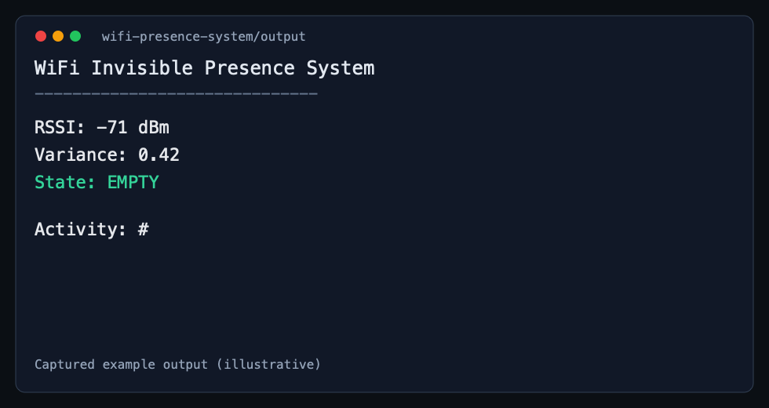
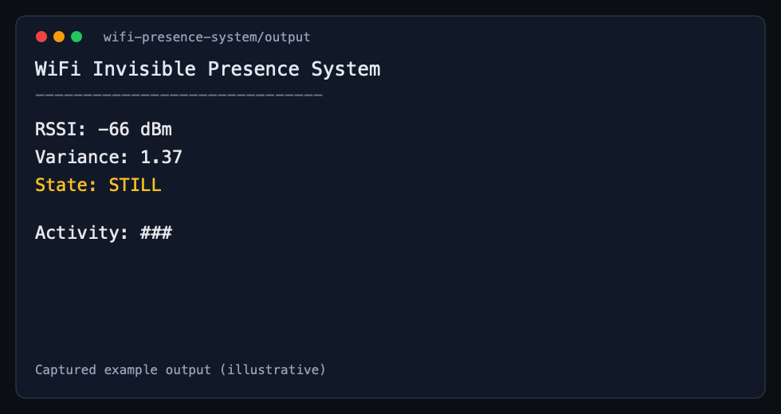
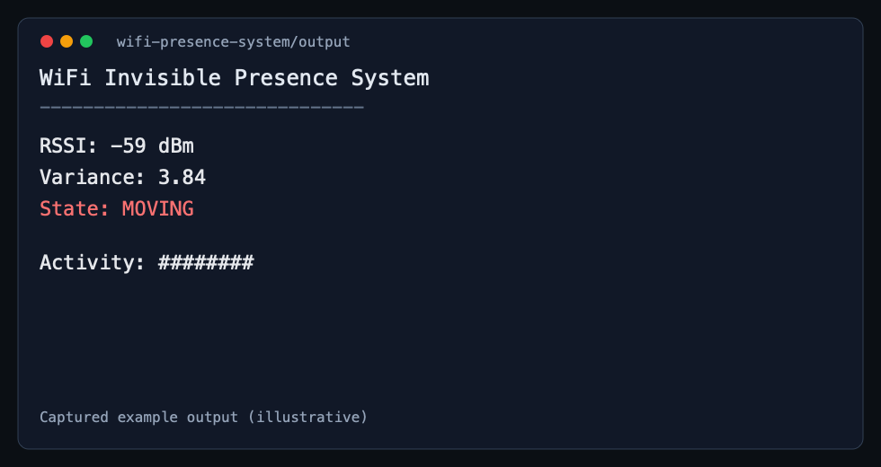

# WiFi Presence System


A lightweight, cross-platform Go project that estimates room occupancy state from WiFi RSSI fluctuation.

The app reads WiFi signal strength repeatedly, keeps a rolling window of samples, computes variance, and maps that variance to a presence state:

- EMPTY
- STILL
- MOVING

## Features

- Cross-platform RSSI readers with Go build tags:
  - macOS (darwin)
  - Linux
  - Windows
- Rolling-window variance calculation for activity detection
- Simple terminal dashboard with live updates
- Clean package split for sensors, models, processing, and websocket hub

## How It Works

1. Read RSSI from the operating system.
2. Push RSSI into a fixed-size sliding window.
3. Compute variance on the current window.
4. Classify state with thresholds:
   - variance > 2.0 => MOVING
   - variance > 1.0 => STILL
   - otherwise => EMPTY
5. Print a live dashboard and activity bar in terminal.

## Project Structure

```text
wifi-presence-system/
├── main.go
├── go.mod
├── sensors/
│   ├── rssi_darwin.go
│   ├── rssi_linux.go
│   └── rssi_windows.go
├── models/
│   └── models.go
├── processor/
│   └── processor.go
├── ws/
│   └── hub.go
└── docs/
    └── screenshots/
    ├── output-empty.png
    ├── output-still.png
    └── output-moving.png
```

## Prerequisites

- Go 1.25+
- Access to WiFi interface information on your OS

Platform notes:

- macOS: uses wdutil info (currently invoked with sudo in darwin sensor)
- Linux: uses nmcli
- Windows: uses netsh wlan show interfaces

## Setup

```bash
git clone <your-repo-url>
cd wifi-presence-system
go mod tidy
```

## Run

### Quick run

```bash
go run .
```

### Build and run binary

```bash
go build
./wifi-presence-system
```

## Output Examples

### EMPTY state sample



### STILL state sample



### MOVING state sample



## Tuning Detection Thresholds

You can tune sensitivity in main.go by adjusting detectState:

- Lower thresholds make activity detection more sensitive.
- Higher thresholds make it less sensitive.

## Development Notes

- Sensor readers are selected automatically by OS build tags.
- Core presence calculation currently runs in main.go.
- Additional processing utilities exist in processor and models packages for future integration.

## Troubleshooting

### RSSI parsing errors on macOS

If you see parsing issues from wdutil output, verify the RSSI line format on your machine:

```bash
sudo wdutil info
```

### Permission issues on macOS

If RSSI access fails, run with a terminal session that can execute sudo commands.

### Linux returns empty RSSI

Ensure NetworkManager is available and connected:

```bash
nmcli dev status
```

## Roadmap Ideas

- Emit JSON output mode for downstream analytics
- Web dashboard using websocket hub
- Per-device calibration profiles
- Adaptive thresholds by noise baseline

## License

This project is licensed under the terms in the LICENSE file.
